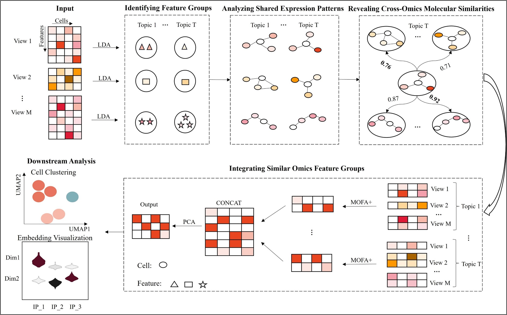

# scMFG: a single-cell Multi-omics Integration Method based on Feature Grouping



## Installation

### install from GitHub
install the latest develop version

    pip install git+https://github.com/LiangYu-Xidian/scMFG.git

or git clone and install

    git clone git://github.com/LiangYu-Xidian/scMFG.git
    cd scMFG
    python setup.py install
    

## Quick Start

scMFG takes as an input a Muon object and populates its `obsm` field with the embeddings.


```python
import scanpy as sc
import muon as mu
from scmfg import SCMFG

# Load data and generate a Muon object.
rna = sc.read_h5ad("RNA.h5ad")
atac = sc.read_h5ad("ATAC.h5ad")
mdata = mu.MuData({"rna": rna, "atac": atac})

# Initialize and run the model.
model = SCMFG(mdata)
model.run()

# Visualize the embedding with UMAP.
sc.pp.neighbors(mdata, use_rep="X_scMFG")
sc.tl.umap(mdata)
sc.pl.umap(mdata)
```
